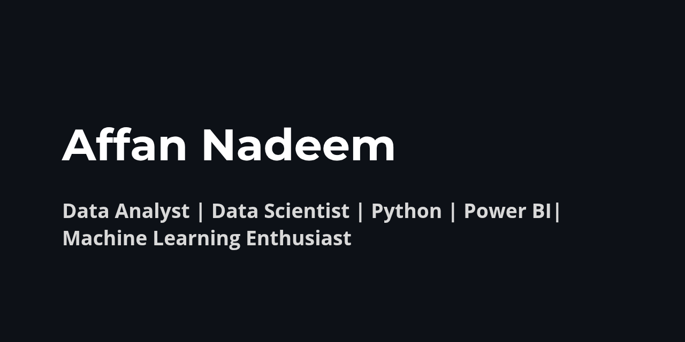

# 👋 Hi, I'm Affan Nadeem  

📊 **Aspiring Data Analyst & Machine Learning Enthusiast**  
Transforming raw data into meaningful insights using Python, Power BI, and Tableau.  

---

## 🚀 About Me  
- Skilled in **Python (Pandas, NumPy, Scikit-learn)** for data analysis & modeling  
- Experienced with **EDA, visualization, and predictive analytics**  
- Hands-on with **Power BI & Tableau** for interactive dashboards  
- Passionate about solving problems with **data-driven decision making**  

---

## 🎓 Education  
**Intermediate in Computer Science**  
(2023, 2025)  

---

## 🛠️ Projects  

- **[Titanic Survival Prediction](https://github.com/Affan005-ai/Titanic-EDA-ML)** – EDA + ML model predicting survival with ~80% accuracy.  
- **[Netflix Data Analysis](https://github.com/Affan005-ai/Netflix-EDA)** – Visualized top genres, ratings, and country content trends.  
- **[Spotify Charts Analysis](https://github.com/Affan005-ai/Spotify-EDA)** – Analyzed audio features and popularity of top artists.  
- **[Black Friday Sales Prediction](https://github.com/Affan005-ai/Black-Friday-Sales)** – Predicted purchase amounts using ML regression models.  
- **[Power BI Retail Dashboard](https://github.com/Affan005-ai/PowerBI-Retail-Sales)** – Interactive dashboard for sales by product, region, and customers.  

---

## 🧰 Technical Skills  
- **Programming:** Python (Pandas, NumPy, Matplotlib, Seaborn, Scikit-learn)  
- **Visualization Tools:** Power BI, Tableau  
- **Databases:** MySQL (queries, joins, aggregations)  
- **Other Tools:** Jupyter Notebook, GitHub, Excel  
- **Machine Learning:** Regression, Classification, Data Preprocessing  

---

## 💡 Strengths  
✔ Strong analytical & problem-solving skills  
✔ Hands-on with real datasets & EDA  
✔ Quick learner with a passion for data-driven solutions  
✔ Detail-oriented & good at presenting insights visually  

---

## 📬 Contact Me  
📧 Email: **affannadeem005@gmail.com**  
🌐 GitHub: [Affan005-ai](https://github.com/Affan005-ai)  
💼 LinkedIn: [Affan Nadeem](https://www.linkedin.com/in/affan-nadeem-801b21375/)  

---

⭐️ _“Passionate about learning, growing, and delivering value through data.”_